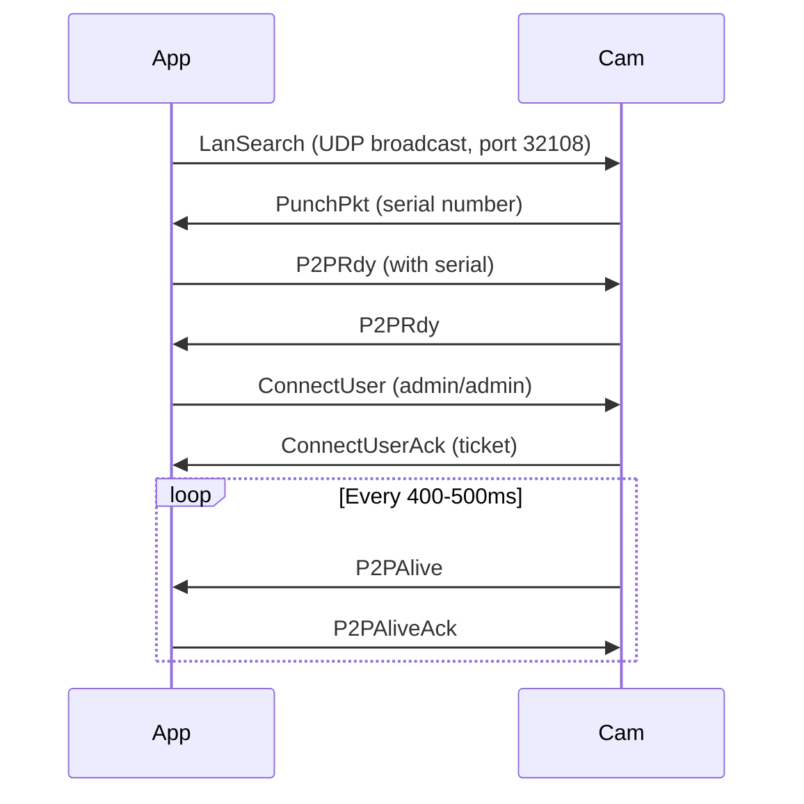
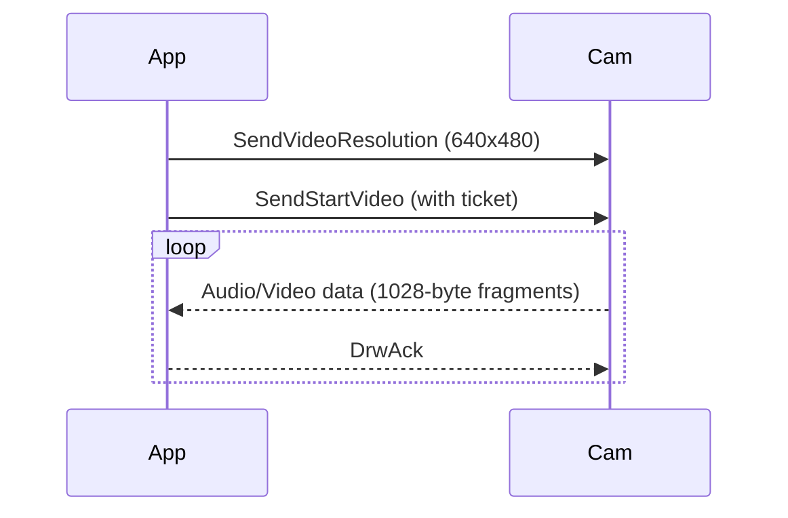

# iLnkP2P Protocol

Reverse-engineered protocol used by X5/A9/A7 IP cameras. Communication happens over UDP on port 32108.

## Packet structure

Base packet format:


The `Drw` command (`0xf1d0`) carries both control and data payloads, discriminated by the second byte.

### Control packets


Payloads longer than 5 bytes are obfuscated with `XqBytesEnc` (XOR-rotation, see below).

### Data packets


Data packets are further discriminated by the first 4 bytes:

- `0x55aa15a8` -- framed audio/video data
- `0xffd8ffdb` -- unframed JPEG start (SOI + DQT)

## Command constants

### Top-level commands

| Name           | Value    | Description                             |
| -------------- | -------- | --------------------------------------- |
| `LanSearch`    | `0xf130` | Device discovery broadcast              |
| `LanSearchExt` | `0xf132` | Extended LAN search                     |
| `PunchPkt`     | `0xf141` | Discovery response (contains serial)    |
| `P2pRdy`       | `0xf142` | Session establishment                   |
| `P2PAlive`     | `0xf1e0` | Keepalive                               |
| `P2PAliveAck`  | `0xf1e1` | Keepalive response                      |
| `Drw`          | `0xf1d0` | Data read/write (control + stream data) |
| `DrwAck`       | `0xf1d1` | Drw acknowledgment                      |
| `Close`        | `0xf1f0` | Close connection                        |
| `Hello`        | `0xf100` | Hello                                   |
| `HelloAck`     | `0xf101` | Hello ack                               |
| `PunchTo`      | `0xf140` | Punch to                                |
| `RlyTo`        | `0xf102` | Relay to                                |
| `DevLgnAck`    | `0xf111` | Device login ack                        |
| `P2pReq`       | `0xf120` | P2P request                             |
| `P2PReqAck`    | `0xf121` | P2P request ack                         |
| `LstReq`       | `0xf167` | List request                            |
| `ListenReqAck` | `0xf169` | Listen request ack                      |
| `RlyHelloAck`  | `0xf170` | Relay hello ack                         |
| `RlyHelloAck2` | `0xf171` | Relay hello ack 2                       |

### Control sub-commands (within Drw)

| Name               | Value    | Description                              |
| ------------------ | -------- | ---------------------------------------- |
| `ConnectUser`      | `0x2010` | Login (admin/admin)                      |
| `ConnectUserAck`   | `0x2011` | Login response (contains ticket)         |
| `DevStatus`        | `0x0810` | Query device status                      |
| `DevStatusAck`     | `0x0811` | Status response (battery, WiFi, version) |
| `StartVideo`       | `0x1030` | Start video stream                       |
| `StartVideoAck`    | `0x1031` | Stream started                           |
| `StopVideo`        | `0x1130` | Stop video stream                        |
| `VideoParamSet`    | `0x1830` | Set video resolution                     |
| `VideoParamSetAck` | `0x1831` | Resolution set                           |
| `VideoParamGet`    | `0x1930` | Get video params                         |
| `WifiSettings`     | `0x0260` | Get WiFi settings                        |
| `WifiSettingsAck`  | `0x0261` | WiFi settings response                   |
| `ListWifi`         | `0x0360` | Scan WiFi networks                       |
| `ListWifiAck`      | `0x0361` | WiFi scan results                        |
| `IRToggle`         | `0x0a30` | Toggle IR cut filter                     |
| `Reboot`           | `0x1110` | Reboot camera                            |
| `Shutdown`         | `0x1010` | Shutdown camera                          |

## Session flow

### Discovery and connection



### Video streaming



## Data packet format

Video data arrives in 1028-byte payloads with sequence numbers. Two framing modes exist:

### Framed packets (0x55aa15a8 header)

| Offset | Size | Description                                |
| ------ | ---- | ------------------------------------------ |
| 0      | 4    | Header: `55 aa 15 a8`                      |
| 4      | 1    | Stream type: `0x06` = audio, `0x03` = JPEG |
| 6      | 2    | Sequence ID                                |
| 8      | 4    | Packet length                              |
| 12+16  | var  | Data payload                               |

### Unframed packets

JPEG data arrives raw. A new frame starts with `0xff 0xd8 0xff 0xdb` (SOI + DQT). Subsequent segments are appended until the next SOI or until packet loss is detected.

Packet loss detection: if `pkt_id > rcvSeqId + 1`, the frame is marked as bad and skipped.

## Byte obfuscation

The protocol uses a simple obfuscation (not encryption) for control payloads:

```
XqBytesEnc(data, length, rotate):
  for each byte:
    if byte is odd: byte -= 1
    if byte is even: byte += 1
  rotate left by `rotate` positions
```

`rotate` is always 4 in this implementation. See `func_replacements.js` for the Frida-based original C implementation.

## Resolution values

| Value | Resolution   |
| ----- | ------------ |
| 1     | 320x240      |
| 2     | 640x480      |
| 3     | 640x480 (X5) |
| 4     | 640x480 (X5) |

## Wireshark dissector

A partial Wireshark dissector is included at `dissector.lua`. It registers on UDP port 32108 and decodes all command types with in-place deobfuscation.

Install with:

```bash
make install-wireshark-dissector
```
